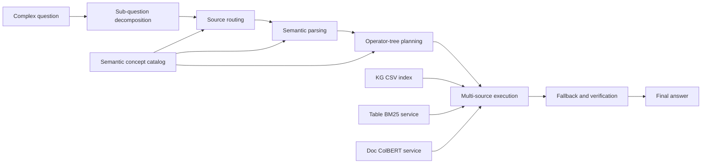

# SCOPE

<div align="center">

**Semantic concept-guided operator planning and execution for multi-source complex question answering**

[](#installation)
[](#retrieval-services)
[](#data-preparation)

</div>

SCOPE is a multi-source QA framework for answering complex questions whose evidence may be distributed across a knowledge graph, relational tables, and free-text documents. It decomposes a complex question into sub-questions, routes each sub-question to suitable knowledge sources, builds a semantic operator plan, executes the plan over live retrieval services, and synthesizes the final answer with traceable intermediate evidence.

The current benchmark setting uses CMQA-style NBA data with three paired-source QA splits: KG-Doc, KG-Table, and Table-Doc.

## Framework

<!-- If you have the original framework figure, put it at assets/framework.png and replace the Mermaid diagram below with:
<p align="center">
  
</p>
-->



## Repository Structure

```text
SCOPE_code/
|-- SCOPE/
|   |-- run.py                         # run SCOPE on one QA file
|   |-- pipeline.py                    # end-to-end orchestration
|   |-- run_route_only.py              # route-only analysis entry
|   |-- qa_bench/                      # benchmark jsonl files
|   |-- data_sources/                  # KG / Table / Doc source files
|   |-- step1_oag/
|   |   |-- extract/                   # source extraction utilities
|   |   `-- fusion/                    # concept fusion and semantic catalog
|   |-- step2_decompose/
|   |   |-- sq.py                      # sub-question decomposition
|   |   |-- route.py                   # graph/semantic source routing
|   |   |-- route_baselines.py         # AtomR / DeepSieve routing variants
|   |   |-- semantic.py                # semantic parse for each sub-query
|   |   `-- operator_plan.py           # operator-tree planning
|   `-- step3_execute/
|       |-- reasoner.py                # multi-source operator executor
|       |-- knowledge_sources/         # KG / Table / Doc operator layers
|       |-- prompts/                   # source-specific prompts
|       `-- service/
|           |-- KG/                    # local KG index and retriever
|           |-- Table/                 # BM25 table index and Flask service
|           `-- Doc/                   # ColBERT document index and service
|-- baseline/                          # compared methods
|   |-- StandardPrompt/
|   |-- CoT/
|   |-- SelfAsk/
|   |-- StandardRAG/
|   |-- IRCoT/
|   |-- CoK/
|   |-- ToG2/
|   |-- HydraRAG/
|   |-- DeepSieve/
|   `-- Atomr/
|-- CMQA/                              # raw benchmark/data source package
|-- run_ex_main.py                     # main experiment runner
|-- run_ex_abla.py                     # ablation experiment runner
`-- show_progress.py                   # terminal progress visualization
```

## Installation

We recommend Python 3.10+ for the SCOPE pipeline and a separate Python 3.8 ColBERT environment for the document retrieval service.

```bash
conda create -n scope python=3.10 -y
conda activate scope

pip install flask requests openpyxl tqdm numpy pandas scikit-learn rapidfuzz sentence-transformers
```

For the ColBERT document service:

```bash
cd SCOPE/step3_execute/service/Doc
conda env create -f conda_env.yml
conda activate colbert
pip install -e .
```

If you run ColBERT on CPU only, use `conda_env_cpu.yml` instead.

## Expected Server Layout

The full experiment scripts use absolute paths under `/root/autodl-tmp`. The easiest setup is:

```text
/root/autodl-tmp/
|-- new_model/                         # this repo's SCOPE/ directory
|-- baseline/                          # this repo's baseline/ directory
|-- eval/                              # evaluator scripts and models_config.py
|-- run_ex_main.py
|-- run_ex_abla.py
`-- show_progress.py
```

For example:

```bash
cd /root/autodl-tmp
ln -s /path/to/SCOPE_code/SCOPE new_model
ln -s /path/to/SCOPE_code/baseline baseline
cp /path/to/SCOPE_code/run_ex_main.py .
cp /path/to/SCOPE_code/run_ex_abla.py .
cp /path/to/SCOPE_code/show_progress.py .
```

If you keep another layout, update the path constants in `run_ex_main.py`, `run_ex_abla.py`, `show_progress.py`, and `SCOPE/step3_execute/service/Table/table_retriever.py`.

## Data Preparation

Copy the two CMQA folders into the SCOPE runtime directories:

```bash
# From the repository root.
mkdir -p SCOPE/data_sources SCOPE/qa_bench
cp -r CMQA/data_sources/* SCOPE/data_sources/
cp -r CMQA/qa_bench/* SCOPE/qa_bench/
```

After copying, the expected benchmark files are:

```text
SCOPE/qa_bench/
|-- kg-doc-1154.jsonl
|-- kg-table-1147.jsonl
`-- table-doc-1120.jsonl
```

The expected source files are:

```text
SCOPE/data_sources/
|-- KG/                                # entity and relation CSV files
|-- Table/                             # metadata.sql and nba_wikisql.sql
`-- Text/                              # wiki documents and TSV text corpus
```

When using the `/root/autodl-tmp` layout, run the same copy under `/root/autodl-tmp/new_model`.

## Retrieval Services

SCOPE loads KG files in process, but Table and Doc retrieval are served over local HTTP APIs.

### Table BM25 Service

```bash
cd /root/autodl-tmp/new_model/step3_execute/service/Table

# One-time index build.
python3 build_table_index.py \
  --metadata_sql ../../../data_sources/Table/metadata.sql \
  --out table_bm25_index.pkl

# Start the service at http://127.0.0.1:1216/api/search
python3 serve_table_bm25.py \
  --index table_bm25_index.pkl \
  --host 127.0.0.1 \
  --port 1216
```

### Doc ColBERT Service

```bash
cd /root/autodl-tmp/new_model/step3_execute/service/Doc

# Prepare the collection TSV if needed.
mkdir -p data_tsv
cp /root/autodl-tmp/new_model/data_sources/Text/nba_datalake_title_text.tsv \
   data_tsv/nba_datalake_title_text.tsv

# One-time index build. Requires model_checkpoints/colbertv2.0.
python3 index_nba_datalake.py

# Start the service at http://127.0.0.1:1215/api/search
python3 setup_service_nba_datalake.py
```

Quick health checks:

```bash
curl "http://127.0.0.1:1216/api/search?query=LeBron%20James&k=3"
curl "http://127.0.0.1:1215/api/search?query=LeBron%20James&k=3"
```

## LLM Configuration

For a single SCOPE run, pass the LLM endpoint directly:

```bash
export LLM_BASE_URL="https://YOUR-ENDPOINT/v1"
export LLM_MODEL="deepseek-chat"
export LLM_API_KEY="YOUR_API_KEY"
```

For full experiments, fill in the placeholders in:

```text
run_ex_main.py
|-- LLM_CONFIGS
|-- JUDGE_LLM_URL
|-- JUDGE_LLM_MODEL
`-- JUDGE_API_KEYS_BY_DATASET

run_ex_abla.py
|-- LLM_CONFIGS
|-- JUDGE_LLM_URL
|-- JUDGE_LLM_MODEL
`-- JUDGE_API_KEY
```

## Run SCOPE Only

```bash
cd /root/autodl-tmp/new_model

python3 run.py \
  --input qa_bench/kg-doc-1154.jsonl \
  --gold qa_bench/kg-doc-1154.jsonl \
  --output-dir result/scope/kg_doc \
  --kb kg,doc \
  --routing-mode graph \
  --prompt-version v2 \
  --workers 8 \
  --llm-url "$LLM_BASE_URL" \
  --llm-model "$LLM_MODEL" \
  --api-key "$LLM_API_KEY"
```

Use the matching `--kb` setting for each split:

| Split | File | `--kb` |
|---|---|---|
| KG-Doc | `qa_bench/kg-doc-1154.jsonl` | `kg,doc` |
| KG-Table | `qa_bench/kg-table-1147.jsonl` | `kg,table` |
| Table-Doc | `qa_bench/table-doc-1120.jsonl` | `table,doc` |

Each run writes:

```text
result/scope/<split>/
|-- predictions.jsonl
|-- summary.json
`-- traces/
```

## Main Experiment

Start the Table BM25 service and Doc ColBERT service first. Then launch the main experiment:

```bash
cd /root/autodl-tmp

# Full run.
python3 run_ex_main.py

# A smaller sanity run.
python3 run_ex_main.py \
  --only-llm deepseek-chat \
  --only-dataset kg_doc \
  --serial-models
```

Visualize progress in another terminal:

```bash
cd /root/autodl-tmp
python3 show_progress.py --watch 30
```

After the runs/evaluation finish, aggregate tables:

```bash
python3 run_ex_main.py --tables-only
```

Main experiment outputs are written to:

```text
/root/autodl-tmp/eval/result/ex_main/
|-- <dataset>/<llm>/<model>/
|   |-- predictions.jsonl
|   |-- traces/
|   `-- cost_summary.json
|-- <dataset>/<llm>/eval_summary/summary.json
`-- tables/main_tables.xlsx
```

If an optional baseline is not prepared, skip it explicitly, for example:

```bash
python3 run_ex_main.py --skip-model aop
```

## Ablation Experiment

Run the main experiment first, because the ablation table reads the full SCOPE results from `ex_main`.

```bash
cd /root/autodl-tmp

# Full ablation run.
python3 run_ex_abla.py

# A smaller sanity run.
python3 run_ex_abla.py \
  --only-llm deepseek-chat \
  --only-dataset kg_doc \
  --serial-models
```

Visualize ablation progress:

```bash
python3 show_progress.py --mode abla --watch 30
```

Aggregate ablation tables:

```bash
python3 run_ex_abla.py --tables-only
```

Ablation outputs are written to:

```text
/root/autodl-tmp/eval/result/ex_abla/
|-- <dataset>/<llm>/<ablation_model>/predictions.jsonl
|-- <dataset>/<llm>/eval_summary/summary.json
`-- tables/abla_tables.xlsx
```

The implemented ablation variants are:

| Variant | Purpose |
|---|---|
| `new_modl_wo_semlist_atomr` | Replace SCOPE routing with AtomR-style routing and remove semantic-list content. |
| `new_modl_wo_semlist_deepsieve` | Replace SCOPE routing with DeepSieve-style routing and remove semantic-list content. |
| `new_modl_wo_decomp` | Remove question decomposition. |
| `new_modl_wo_fallback` | Remove fallback-source retry. |
| `new_modl_wo_semlist_plan` | Remove semantic-list metadata from operator planning. |
| `new_modl_wo_opplan` | Remove operator-tree planning. |

## Results

The experiment scripts produce Excel tables for strict and loose final-answer accuracy:

```text
/root/autodl-tmp/eval/result/ex_main/tables/main_tables.xlsx
/root/autodl-tmp/eval/result/ex_abla/tables/abla_tables.xlsx
```

Add the finalized paper numbers here before release.

## Troubleshooting

- `openpyxl not installed`: install `openpyxl` to enable Excel export.
- `Table index not found`: run `build_table_index.py` before starting `serve_table_bm25.py`.
- `Could not find ColBERT index`: run `index_nba_datalake.py` and make sure `model_checkpoints/colbertv2.0` exists.
- `SQL file not found at /root/autodl-tmp/new_model/data_sources/Table/nba_wikisql.sql`: use the expected server layout or update `TableRetriever.WIKISQL_PATH`.
- Missing `eval/models_config.py` or `evaluate_answer_*.py`: place the evaluation package under `/root/autodl-tmp/eval`.

## Citation

If you find this repository useful, please cite our paper. The BibTeX entry will be added after the paper metadata is finalized.

## License

This project is released for research use. Please check the licenses of CMQA, ColBERT, and each baseline before redistribution.
