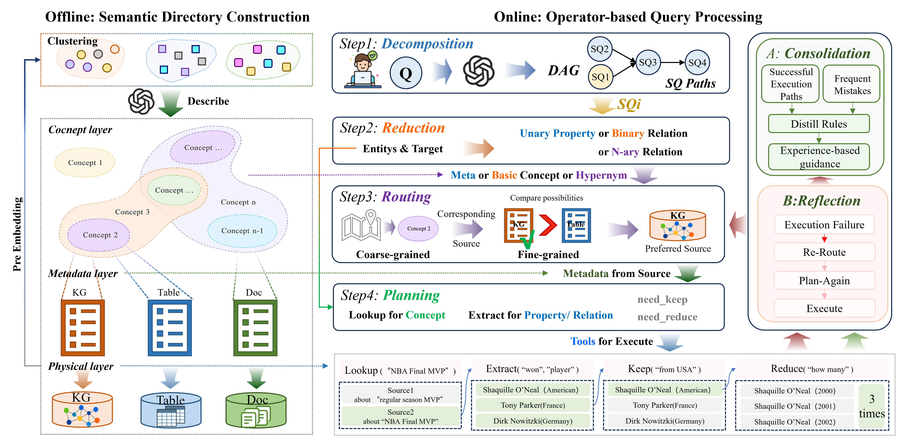
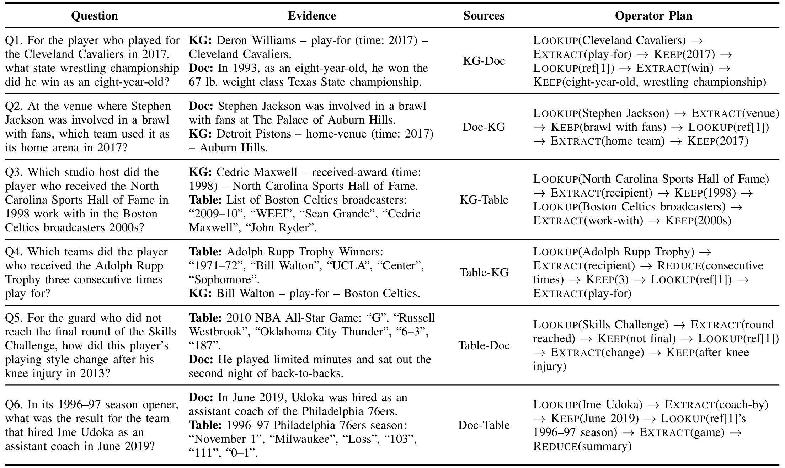

# 🧠 SCOPE: an operator planning framework guided by a semantic directory

<div align="center">

**SCOPE: an operator planning framework guided by a semantic directory**

> Code for **Bridging Heterogeneous Evidence for Multi-Source Question Answering**

[](#installation)
[](#retrieval-services)
[](#data-preparation)

</div>

SCOPE is a multi-source QA framework designed to answer complex questions whose evidence is distributed across heterogeneous sources such as knowledge graphs, relational tables, and unstructured documents, without physically merging the underlying data. To bridge these heterogeneous sources, SCOPE first constructs an offline semantic directory that aligns them through meta, basic, and hyper concepts. During online inference, it performs fine-grained source routing and unified operator planning based on this directory, organizing cross-source knowledge access into executable operator plans. The framework then executes these plans over live retrieval services and synthesizes the final answer with traceable intermediate evidence.

We also introduce a new benchmark for multi-source QA over heterogeneous sources, CMQA. CMQA is a challenging multi-source QA benchmark where each question requires joint reasoning across multiple heterogeneous sources and cannot be reliably answered from a single source or from model parametric knowledge alone. Specifically, we adopt CMQA-style NBA data with three paired-source QA splits: KG-Doc, KG-Table, and Table-Doc.

## 🧩 Framework

<p align="center">
  
</p>

## 🧪 Benchmark
<p align="center">
  
</p>

## 📁 Repository Structure

```text
SCOPE_code/
|-- SCOPE/                  # core SCOPE pipeline
|   |-- qa_bench/           # CMQA benchmark files
|   |-- data_sources/       # KG / Table / Doc sources
|   |-- step1_oag/          # semantic directory construction
|   |-- step2_decompose/    # decomposition, routing, and planning
|   `-- step3_execute/      # operator execution and retrieval services
|-- CMQA/                   # benchmark and raw source package
|-- baseline/               # compared methods
|-- wo_abla/                # ablation variants
|-- eval/                   # evaluation and result aggregation
|-- configs/                # environment configuration
|-- scripts/                # reproducibility helpers
|-- run_ex_main.py          # main experiment runner
`-- run_ex_abla.py          # ablation experiment runner
```

## 🛠️ Installation

We recommend Python 3.10+ for the SCOPE pipeline and a separate Python 3.8 ColBERT environment for the document retrieval service.

```bash
conda create -n scope python=3.10 -y
conda activate scope

pip install flask requests openpyxl tqdm numpy pandas scikit-learn rapidfuzz sentence-transformers
```

For the ColBERT document service:

```bash
cd SCOPE_code/SCOPE/step3_execute/service/Doc
conda env create -f conda_env.yml
conda activate colbert
pip install -e .
```

If you run ColBERT on CPU only, use `conda_env_cpu.yml` instead.

## 🖥️ Portable Layout and Environment Variables

The experiment scripts now default to paths inside this repository, so a fresh clone can be used without recreating any machine-specific layout.

Default paths:

```text
SCOPE_code/
|-- SCOPE/                  # SCOPE_NEW_MODEL_DIR
|-- baseline/               # SCOPE_BASELINE_DIR for main baselines
|-- wo_abla/                # SCOPE_ABLA_BASELINE_DIR for ablation runner
|-- eval/                   # SCOPE_EVAL_DIR
|-- eval/results/ex_main/    # SCOPE_RESULT_ROOT
|-- eval/results/ex_abla/    # SCOPE_ABLA_RESULT_ROOT
```

If your files live elsewhere, override the defaults with environment variables:

```bash
export SCOPE_NEW_MODEL_DIR=/path/to/SCOPE_code/SCOPE
export SCOPE_BASELINE_DIR=/path/to/SCOPE_code/baseline
export SCOPE_ABLA_BASELINE_DIR=/path/to/SCOPE_code/wo_abla
export SCOPE_EVAL_DIR=/path/to/SCOPE_code/eval
export SCOPE_QA_BENCH=/path/to/SCOPE_code/SCOPE/qa_bench
export SCOPE_RESULT_ROOT=/path/to/results/ex_main
export SCOPE_ABLA_RESULT_ROOT=/path/to/results/ex_abla
```

A complete example configuration is provided in `SCOPE_code/configs/llm.example.env`.

## 📚 Data Preparation

Copy the two CMQA folders into the SCOPE runtime directories:

```bash
# From the repository root.
mkdir -p SCOPE_code/SCOPE/data_sources SCOPE_code/SCOPE/qa_bench
cp -r SCOPE_code/CMQA/data_sources/* SCOPE_code/SCOPE/data_sources/
cp -r SCOPE_code/CMQA/qa_bench/* SCOPE_code/SCOPE/qa_bench/
```

After copying, the expected benchmark files are:

```text
SCOPE_code/SCOPE/qa_bench/
|-- kg-doc-1154.jsonl
|-- kg-table-1147.jsonl
|-- table-doc-1120.jsonl
```

The expected source files are:

```text
SCOPE_code/SCOPE/data_sources/
|-- KG/                                # entity and relation CSV files
|-- Table/                             # metadata.sql and nba_wikisql.sql
|-- Text/                              # wiki documents and TSV text corpus
```

## 🧰 Retrieval Services

SCOPE loads KG files in process, but Table and Doc retrieval are served over local HTTP APIs.

### Table BM25 Service

```bash
cd SCOPE_code/SCOPE/step3_execute/service/Table

# One-time index build.
python3 build_table_index.py \
  --metadata_sql ../../../data_sources/Table/metadata.sql \
  --out table_bm25_index.pkl

# Start the service at http://127.0.0.1:1216/api/search
python3 serve_table_bm25.py \
  --index table_bm25_index.pkl \
  --host 127.0.0.1 \
  --port 1216
```

### Doc ColBERT Service

```bash
cd SCOPE_code/SCOPE/step3_execute/service/Doc

# Prepare the collection TSV if needed.
mkdir -p data_tsv
cp ../../../data_sources/Text/nba_datalake_title_text.tsv \
   data_tsv/nba_datalake_title_text.tsv

# One-time index build. Requires model_checkpoints/colbertv2.0.
python3 index_nba_datalake.py

# Start the service at http://127.0.0.1:1215/api/search
python3 setup_service_nba_datalake.py
```

Quick health checks:

```bash
curl "http://127.0.0.1:1216/api/search?query=LeBron%20James&k=3"
curl "http://127.0.0.1:1215/api/search?query=LeBron%20James&k=3"
```

## 🔐 LLM and Judge Configuration

The released artifact does not contain private API keys or private endpoints. All generator and judge endpoints are supplied through environment variables. The scripts accept OpenAI-compatible chat-completion APIs.

```bash
cd SCOPE_code
cp configs/llm.example.env .env
# Edit .env, then either source it or export the variables manually.
set -a
source .env
set +a
```

Required variables for a basic run:

```bash
export LLM_BASE_URL="https://api.example.com/v1"
export LLM_MODEL="deepseek-chat"
export LLM_API_KEY="YOUR_API_KEY"
```

Judge-specific variables are optional. If they are omitted, the evaluator reuses `LLM_BASE_URL` and `LLM_API_KEY`:

```bash
export JUDGE_LLM_BASE_URL="https://api.example.com/v1"
export JUDGE_LLM_MODEL="deepseek-chat"
export JUDGE_LLM_API_KEY="YOUR_JUDGE_API_KEY"
```

For multi-LLM experiments, any family can be overridden with a slug-specific variable, for example `DEEPSEEK_CHAT_BASE_URL`, `DEEPSEEK_CHAT_API_KEY`, `GPT_4O_MINI_BASE_URL`, and `GPT_4O_MINI_API_KEY`.

## 🚀 Run SCOPE Only

```bash
cd SCOPE_code/SCOPE

python3 run.py \
  --input qa_bench/kg-doc-1154.jsonl \
  --gold qa_bench/kg-doc-1154.jsonl \
  --output-dir result/scope/kg_doc \
  --kb kg,doc \
  --routing-mode graph \
  --prompt-version v2 \
  --workers 8 \
  --llm-url "$LLM_BASE_URL" \
  --llm-model "$LLM_MODEL" \
  --api-key "$LLM_API_KEY"
```

Use the matching `--kb` setting for each split:

| Split | File | `--kb` |
|---|---|---|
| KG-Doc | `qa_bench/kg-doc-1154.jsonl` | `kg,doc` |
| KG-Table | `qa_bench/kg-table-1147.jsonl` | `kg,table` |
| Table-Doc | `qa_bench/table-doc-1120.jsonl` | `table,doc` |

 --kb supports comma-separated values: kg,table,doc (performance remains stable with expanded data scope)

Each run writes:

```text
result/scope/<split>/
|-- predictions.jsonl
|-- summary.json
|-- traces/
```

## 🧪 Main Experiment

Start the Table BM25 service and Doc ColBERT service first. Then launch the main experiment:

```bash
cd SCOPE_code

# Full run.
python3 run_ex_main.py

# A smaller sanity run.
python3 run_ex_main.py \
  --only-llm deepseek-chat \
  --only-dataset kg_doc \
  --serial-models
```

Visualize progress in another terminal:

```bash
cd SCOPE_code
python3 show_progress.py --watch 30
```

After the runs/evaluation finish, aggregate tables:

```bash
python3 run_ex_main.py --tables-only
```

Main experiment outputs are written to:

```text
SCOPE_code/eval/results/ex_main/
|-- <dataset>/<llm>/<model>/
|   |-- predictions.jsonl
|   |-- traces/
|   |-- cost_summary.json
|-- <dataset>/<llm>/eval_summary/summary.json
|-- tables/main_tables.xlsx
```

## 🔬 Ablation Experiment

Run the main experiment first, because the ablation table reads the full SCOPE results from `ex_main`.

```bash
cd SCOPE_code

# Full ablation run.
python3 run_ex_abla.py

# A smaller sanity run.
python3 run_ex_abla.py \
  --only-llm deepseek-chat \
  --only-dataset kg_doc \
  --serial-models
```

Visualize ablation progress:

```bash
python3 show_progress.py --mode abla --watch 30
```

Aggregate ablation tables:

```bash
python3 run_ex_abla.py --tables-only
```

Ablation outputs are written to:

```text
SCOPE_code/eval/results/ex_abla/
|-- <dataset>/<llm>/<ablation_model>/predictions.jsonl
|-- <dataset>/<llm>/eval_summary/summary.json
|-- tables/abla_tables.xlsx
```

The implemented ablation variants are:

| Variant | Purpose |
|---|---|
| `new_modl_wo_semlist_atomr` | Replace SCOPE routing with AtomR-style routing and remove semantic-list content. |
| `new_modl_wo_semlist_deepsieve` | Replace SCOPE routing with DeepSieve-style routing and remove semantic-list content. |
| `new_modl_wo_decomp` | Remove question decomposition. |
| `new_modl_wo_fallback` | Remove fallback-source retry. |
| `new_modl_wo_semlist_plan` | Remove semantic-list metadata from operator planning. |
| `new_modl_wo_opplan` | Remove operator-tree planning. |

## 📊 Results

The experiment scripts produce Excel tables for strict and loose final-answer accuracy:

```text
SCOPE_code/eval/results/ex_main/tables/main_tables.xlsx
SCOPE_code/eval/results/ex_abla/tables/abla_tables.xlsx
```

This repository includes lightweight sampled artifacts under `SCOPE_code/eval/sample_results/`. They are intended for quick artifact inspection and format checking without rerunning LLM inference, not for reproducing the full-data paper scores.

```text
SCOPE_code/eval/sample_results/
|-- samples/
|   |-- kg_doc/sample_ids.json
|   |-- kg_doc/samples.jsonl
|   |-- kg_table/sample_ids.json
|   |-- kg_table/samples.jsonl
|   |-- table_doc/sample_ids.json
|   |-- table_doc/samples.jsonl
|-- ex_main/
|   |-- <dataset>/<llm>/<method>/
|   |   |-- source-native prediction/trace files
|   |   |-- cost_summary.json
|   |-- <dataset>/<llm>/eval_summary/
|       |-- records_<method>.json
|       |-- summary.json
|-- ex_abla/
    |-- <dataset>/deepseek-chat/<ablation_model>/
        |-- predictions.jsonl
        |-- summary.json
        |-- cost_summary.json
        |-- traces/                # present when trace artifacts are available
```

The shared `samples/` directory stores the selected 100 questions for each split once; the experiment folders do not duplicate those files. `ex_main` contains sampled results for `deepseek-chat`, `gpt-4o-mini`, and `qwen3-max-2026-01-23` across KG-Doc, KG-Table, and Table-Doc. The sampled main-result methods are `new_model` (SCOPE), `self_ask`, `ircot`, `hydrarag`, `deepsieve`, and `atomr`, with `eval_summary/summary.json` recomputed from the included `records_*.json`. `ex_abla` contains the DeepSeek-Chat ablation predictions and traces for the six implemented ablation variants. See `SCOPE_code/eval/sample_results/README.md` for the exact layout and caveats.

## 🧯 Troubleshooting

- `openpyxl not installed`: install `openpyxl` to enable Excel export.
- `Table index not found`: run `build_table_index.py` before starting `serve_table_bm25.py`.
- `Could not find ColBERT index`: run `index_nba_datalake.py` and make sure `model_checkpoints/colbertv2.0` exists.

## 📖 Citation

If you find this repository useful, please cite our paper. The BibTeX entry will be added after the paper metadata is finalized.

## 📄 License

This project is released for research use. Please check the licenses of SCOPE, CMQA, and each baseline before redistribution.
